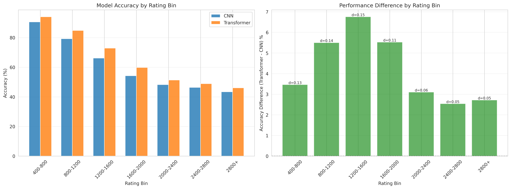
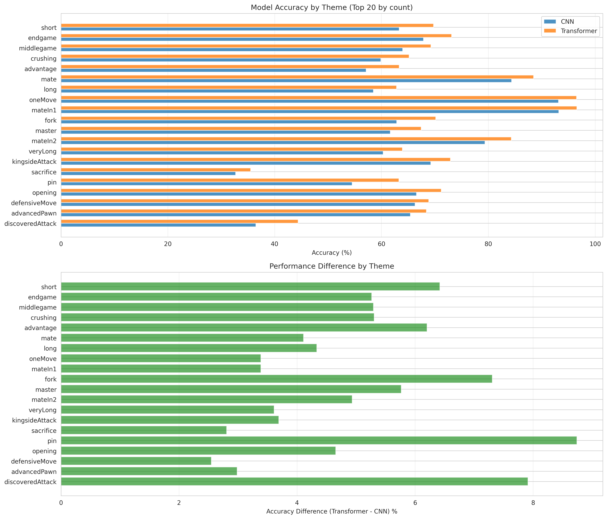
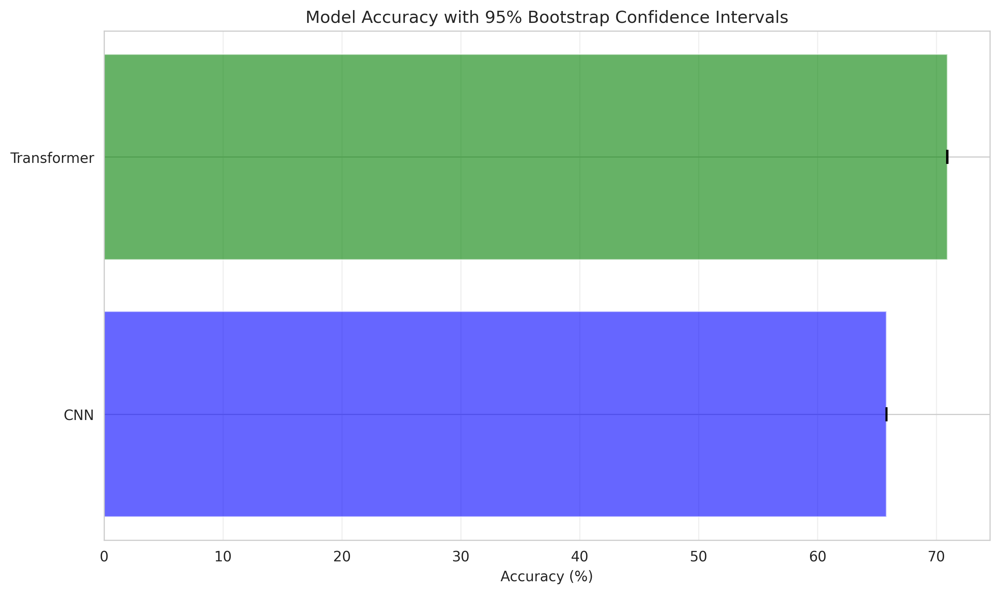
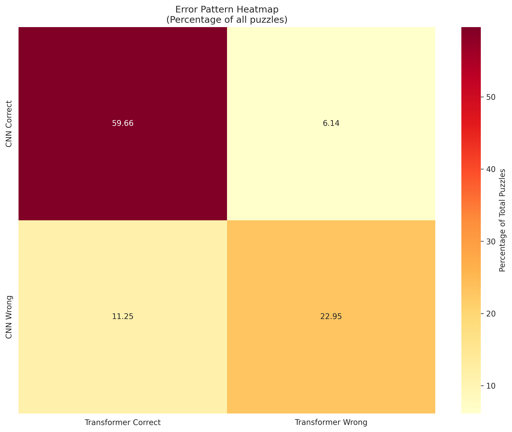

# Statistical Analysis Report: CNN vs Transformer Chess Models

**Analysis Date**: 2026-01-24 11:01:32

---

## Executive Summary

This report presents a comprehensive statistical analysis of 5,600,086 chess puzzle predictions comparing CNN and Transformer models.

## Overall Performance

### Top-1 Accuracy

| Model | Accuracy | 95% CI |
|-------|----------|--------|
| CNN | 65.80% | [65.76, 65.84] |
| Transformer | 70.91% | [70.87, 70.95] |
| **Difference** | **5.11%** | **[5.08, 5.15]** |

## Statistical Tests

### McNemar's Test

- **Chi-square statistic**: 84200.8206
- **P-value**: 0.000000
- **Result**: Statistically significant difference (p < 0.05)

**Contingency Table:**

- CNN correct, Transformer wrong: 343,786
- CNN wrong, Transformer correct: 630,155

## Prediction Agreement

| Category | Count | Percentage |
|----------|-------|------------|
| Both Correct | 3,340,979 | 59.66% |
| Both Wrong | 1,285,166 | 22.95% |
| CNN Only | 343,786 | 6.14% |
| Transformer Only | 630,155 | 11.25% |

## Rating Stratification

Performance breakdown by puzzle difficulty rating:

| Rating Bin   |   Count |   CNN Accuracy (%) |   Transformer Accuracy (%) |   Difference (%) |   Cohen's d |
|:-------------|--------:|-------------------:|---------------------------:|-----------------:|------------:|
| 400-800      |  519803 |            90.5759 |                    94.0377 |          3.46189 |   0.130185  |
| 800-1200     | 1480817 |            79.2681 |                    84.7684 |          5.50027 |   0.143592  |
| 1200-1600    | 1349092 |            66.1406 |                    72.8946 |          6.75395 |   0.147115  |
| 1600-2000    | 1148221 |            54.2324 |                    59.755  |          5.52254 |   0.111721  |
| 2000-2400    |  779902 |            48.2466 |                    51.3472 |          3.10065 |   0.0620432 |
| 2400-2800    |  305270 |            46.3495 |                    48.8895 |          2.54005 |   0.050875  |
| 2800+        |   16981 |            43.3426 |                    46.0574 |          2.7148  |   0.0546224 |

## Theme Stratification

Performance breakdown by puzzle theme (top themes by count):

| Theme            |    Count |   CNN Accuracy (%) |   Transformer Accuracy (%) |   Difference (%) |
|:-----------------|---------:|-------------------:|---------------------------:|-----------------:|
| short            | 693709   |            63.3224 |                    69.7412 |          6.41873 |
| endgame          | 652728   |            67.8574 |                    73.123  |          5.26556 |
| middlegame       | 624683   |            63.9579 |                    69.2531 |          5.2952  |
| crushing         | 517224   |            59.8739 |                    65.18   |          5.30609 |
| advantage        | 418061   |            57.1186 |                    63.322  |          6.2034  |
| mate             | 361345   |            84.3547 |                    88.4653 |          4.11063 |
| long             | 337220   |            58.4802 |                    62.8153 |          4.3351  |
| oneMove          | 172690   |            93.1423 |                    96.5281 |          3.38577 |
| mateIn1          | 171943   |            93.1987 |                    96.5855 |          3.38675 |
| fork             | 159836   |            62.8378 |                    70.1458 |          7.30799 |
| master           | 155849   |            61.6636 |                    67.4289 |          5.76531 |
| mateIn2          | 151316   |            79.3692 |                    84.3021 |          4.93289 |
| veryLong         |  96455.9 |            60.3077 |                    63.9183 |          3.61054 |
| kingsideAttack   |  92353.4 |            69.2261 |                    72.9162 |          3.69007 |
| sacrifice        |  72333   |            32.7041 |                    35.5099 |          2.80577 |
| pin              |  70053.6 |            54.521  |                    63.2638 |          8.7428  |
| opening          |  68912.5 |            66.5505 |                    71.2049 |          4.65443 |
| defensiveMove    |  68626.1 |            66.2923 |                    68.8399 |          2.54759 |
| advancedPawn     |  62247   |            65.424  |                    68.408  |          2.98402 |
| discoveredAttack |  59818.2 |            36.4806 |                    44.3939 |          7.9133  |

## Game Phase Stratification

Performance breakdown by game phase:

| Phase      |   Count |   CNN Accuracy (%) |   Transformer Accuracy (%) |   Difference (%) |   Cohen's d |
|:-----------|--------:|-------------------:|---------------------------:|-----------------:|------------:|
| Opening    | 1910446 |            64.0498 |                    68.8341 |          4.78428 |    0.101451 |
| Middlegame | 2593450 |            66.1784 |                    71.726  |          5.54751 |    0.120113 |
| Endgame    | 1096190 |            67.9465 |                    72.6078 |          4.66124 |    0.102121 |

## Additional Visualizations

### Bootstrap Analysis

### Error Patterns

### Feature Correlations

## Key Findings

1. **Overall Performance**: Transformer outperforms CNN by 5.11% in top-1 accuracy.

2. **Rating Stratification**: Largest performance difference observed in 1200-1600 rating range (6.75%).

3. **Theme Stratification**: Largest performance difference observed for 'pin' theme (8.74%).

4. **Statistical Significance**: McNemar's test indicates a statistically significant difference (p = 0.000000).

## Conclusions

This analysis reveals:

- The models show different strengths across puzzle ratings and themes
- Stratified analysis provides deeper insights than aggregate metrics alone
- Consider ensemble approaches to leverage complementary strengths

## Files Generated

This analysis generated the following output files:

- `analysis_report.md` - This comprehensive report
- `summary_statistics.csv` - Overall summary statistics
- `mcnemar_test.txt` - McNemar's test detailed results
- `bootstrap_confidence.png` - Bootstrap confidence intervals
- `bootstrap_distribution.png` - Bootstrap distribution plot
- `rating_stratification.csv` / `.png` - Performance by rating
- `theme_stratification.csv` / `.png` - Performance by theme
- `phase_stratification.csv` / `.png` - Performance by game phase
- `error_heatmap.png` - Error pattern visualization
- `feature_correlations.png` - Feature-error correlations

---

*Report generated automatically by statistical_analysis.py*
