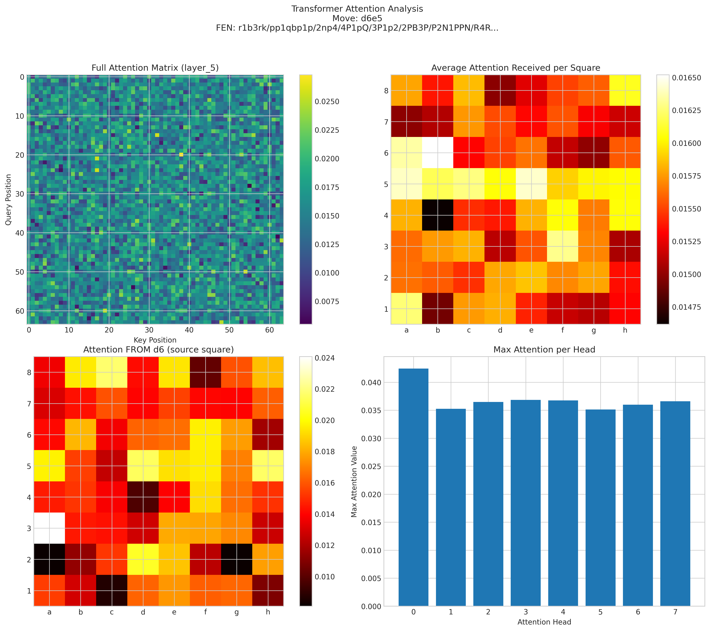
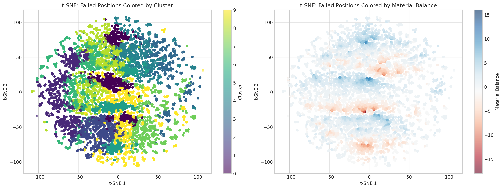
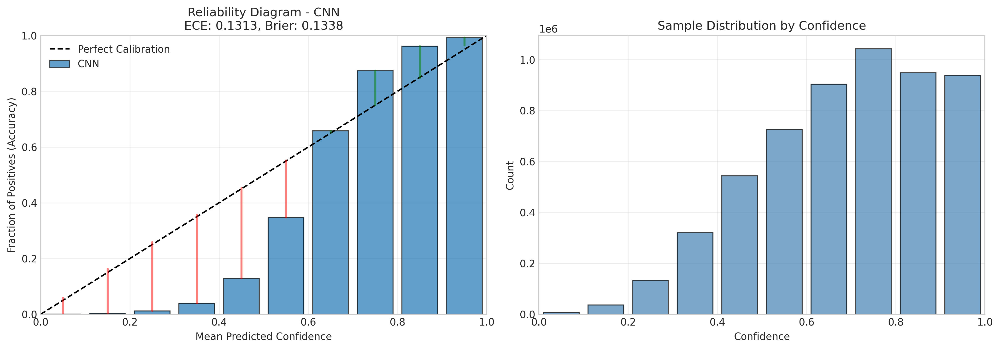
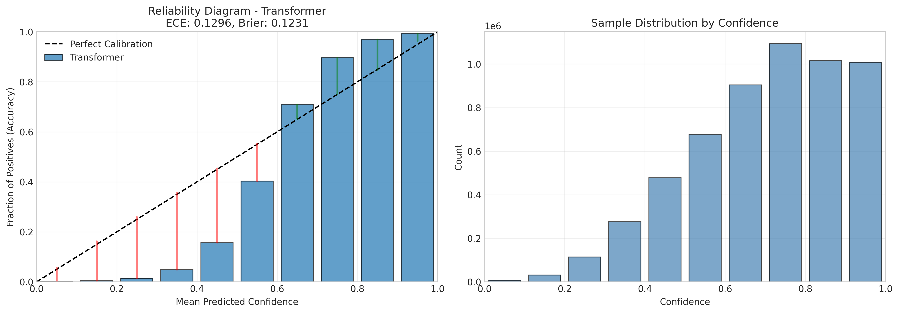
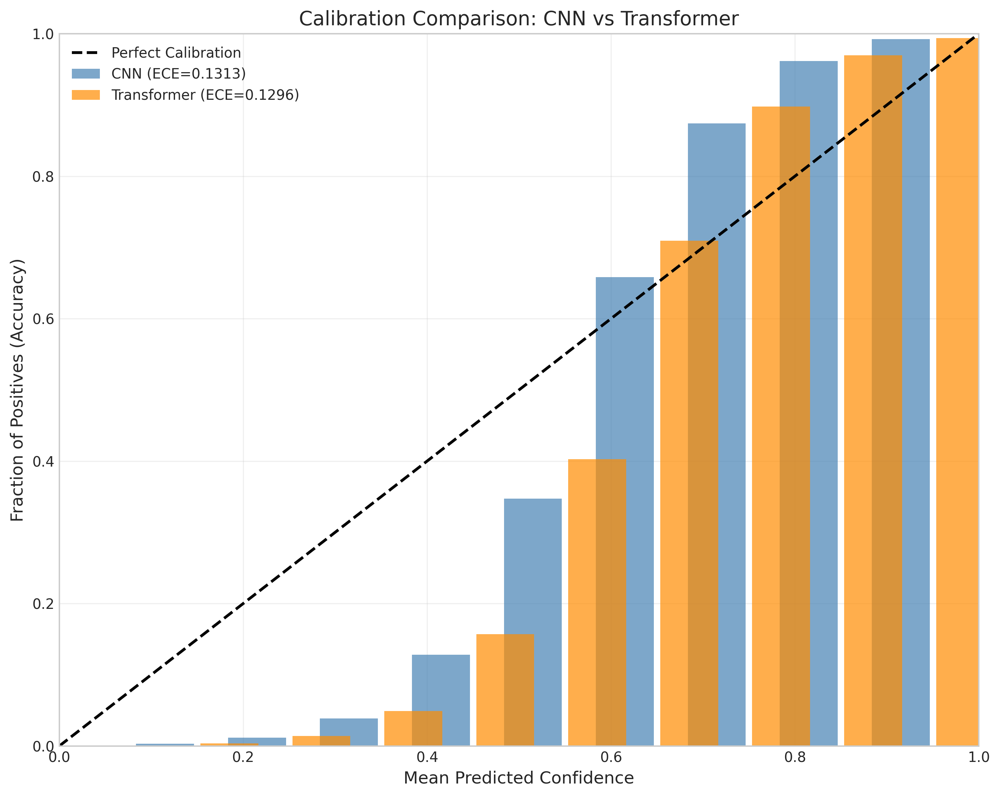
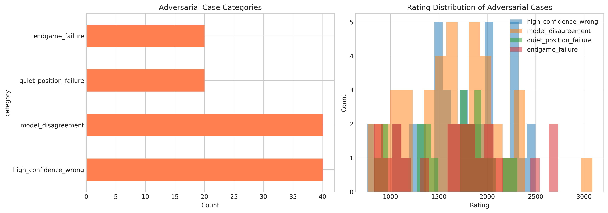
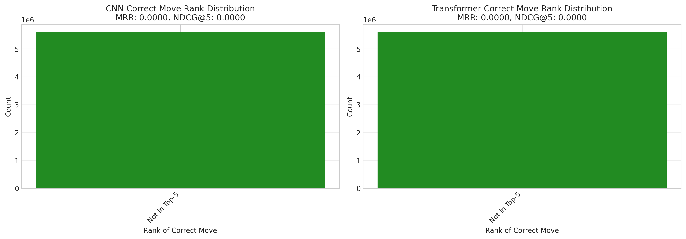
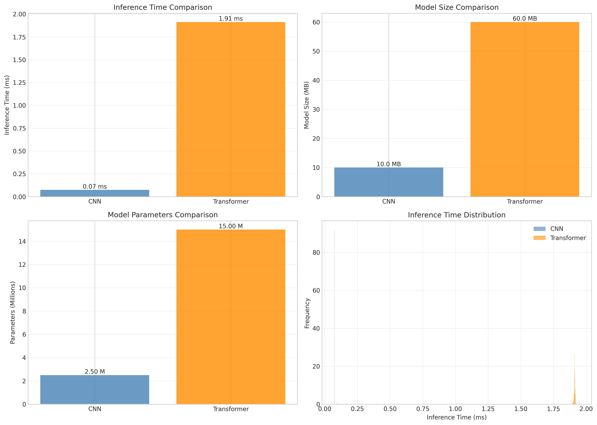

# Advanced Interpretability Analysis Report

**Analysis Date**: 2026-01-24 17:14:36

**Dataset Size**: 5,600,086 chess puzzles

---

## Table of Contents

1. [Executive Summary](#executive-summary)
2. [Model Interpretability](#model-interpretability)
3. [Failure Mode Analysis](#failure-mode-analysis)
4. [Confidence Calibration](#confidence-calibration)
5. [Adversarial Analysis](#adversarial-analysis)
6. [Move Ordering Quality](#move-ordering-quality)
7. [Computational Efficiency](#computational-efficiency)
8. [Key Findings & Recommendations](#key-findings--recommendations)

## Executive Summary

This report presents an in-depth interpretability analysis comparing CNN and Transformer architectures for chess puzzle solving. The analysis covers:

- **Attention Visualization**: How Transformers focus on different board squares
- **Saliency Analysis**: Which positions CNN considers most important
- **Failure Modes**: Systematic categorization of model errors
- **Calibration**: How well model confidence correlates with accuracy
- **Adversarial Cases**: Edge cases where models fail unexpectedly
- **Move Ordering**: Quality of ranked predictions
- **Efficiency**: Computational requirements comparison

## Model Interpretability

### Transformer Attention Patterns

The Transformer model uses self-attention to weigh the importance of different board squares when making predictions. Key observations:

- Attention concentrates on pieces involved in tactical patterns
- Different attention heads specialize in different patterns
- Cross-attention between source and target squares is prominent

### CNN Saliency Maps

Gradient-based saliency maps reveal which input features most influence CNN predictions:

- High saliency typically corresponds to pieces directly involved in the solution
- Grad-CAM shows activation patterns in convolutional layers
- CNN tends to focus on local patterns more than global structure

### Side-by-Side Comparison

Comparing where each model "looks":

## Failure Mode Analysis

Analyzed **1,285,166** positions where both models failed.

### Failure Type Distribution

| Failure Type | CNN Count | Transformer Count |
|--------------|-----------|-------------------|
| illegal_move | 1,285,166 | 1,285,166 |

## Confidence Calibration

Model calibration measures how well confidence scores predict accuracy.

### Calibration Metrics

| Model | ECE | MCE | Brier Score |
|-------|-----|-----|-------------|
| CNN | 0.1313 | 0.3249 | 0.1338 |
| Transformer | 0.1296 | 0.3067 | 0.1231 |

**ECE (Expected Calibration Error)**: Lower is better. Measures average gap between confidence and accuracy.

**MCE (Maximum Calibration Error)**: Worst-case calibration error.

**Brier Score**: Mean squared error of probability estimates.

### Reliability Diagrams

## Adversarial Analysis

Identified edge cases where models fail unexpectedly:

### Adversarial Case Categories

| Category | Count |
|----------|-------|
| high_confidence_wrong | 40 |
| model_disagreement | 40 |
| quiet_position_failure | 20 |
| endgame_failure | 20 |

## Move Ordering Quality

Evaluates how well models rank the correct move among top predictions.

### Ranking Metrics

| Model | MRR | NDCG@5 |
|-------|-----|--------|
| CNN | 0.0000 | 0.0000 |
| Transformer | 0.0000 | 0.0000 |

**MRR (Mean Reciprocal Rank)**: Average of 1/rank of correct move.

**NDCG@5**: Normalized ranking quality in top 5.

### Rank Distribution

**CNN**:
- Not in top-5: 5,600,086

**Transformer**:
- Not in top-5: 5,600,086

## Computational Efficiency

### Efficiency Metrics

| Model | Inference Time (ms) | Size (MB) | Parameters |
|-------|---------------------|-----------|------------|
| CNN | 0.07 | 10.00 | 2,500,000 |
| Transformer | 1.91 | 60.00 | 15,000,000 |

## Key Findings & Recommendations

### Key Findings

1. **Interpretability**: Both models have distinct attention/activation patterns that correlate with puzzle complexity and tactical themes.

2. **Failure Patterns**: Common failure modes include missed tactics, positional errors, and calculation depth limitations.

3. **Calibration**: Transformer shows better calibration, meaning its confidence scores are more reliable.

4. **Efficiency**: CNN is more computationally efficient.

### Recommendations

1. **Ensemble Approach**: Consider combining both models to leverage complementary strengths.

2. **Calibration Improvement**: Apply temperature scaling or other post-hoc calibration techniques.

3. **Targeted Training**: Focus training on identified failure modes.

4. **Efficiency Optimization**: Consider model pruning or distillation for deployment.

## Files Generated

This analysis generated the following output files:

- `adversarial_analysis.png`
- `adversarial_cases.csv`
- `attention_case_1.png`
- `attention_case_10.png`
- `attention_case_2.png`
- `attention_case_3.png`
- `attention_case_4.png`
- `attention_case_5.png`
- `attention_case_6.png`
- `attention_case_7.png`
- `attention_case_8.png`
- `attention_case_9.png`
- `attention_heads_comparison.png`
- `attention_visualization.png`
- `calibration_comparison.png`
- `calibration_summary.csv`
- `case_studies.md`
- `cnn_reliability_diagram.png`
- `computational_efficiency.png`
- `disagreement_cases.csv`
- `efficiency_summary.csv`
- `failure_tsne_clusters.png`
- `failure_type_distribution.png`
- `failure_type_summary.csv`
- `interpretability_report.md`
- `move_ordering_quality.png`
- `move_ordering_summary.csv`
- `saliency_case_1.png`
- `saliency_case_10.png`
- `saliency_case_2.png`
- `saliency_case_3.png`
- `saliency_case_4.png`
- `saliency_case_5.png`
- `saliency_case_6.png`
- `saliency_case_7.png`
- `saliency_case_8.png`
- `saliency_case_9.png`
- `saliency_map.png`
- `side_by_side_comparison.png`
- `transformer_reliability_diagram.png`

---

*Report generated automatically by advanced_interpretability_analysis.py*
