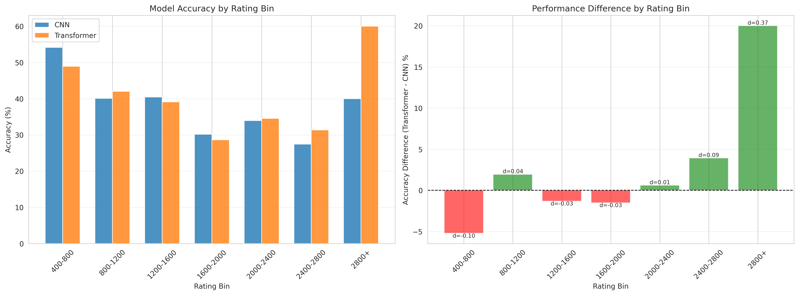
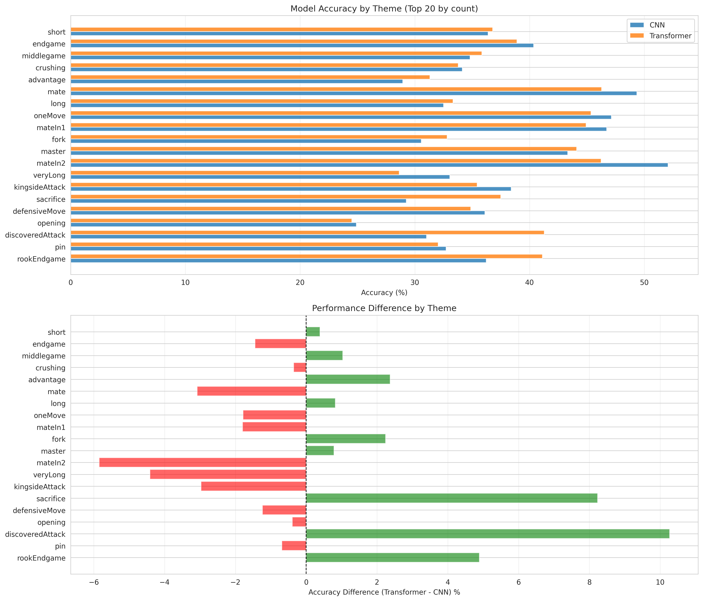
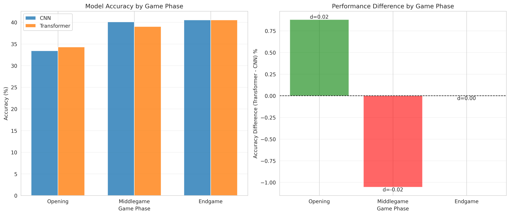
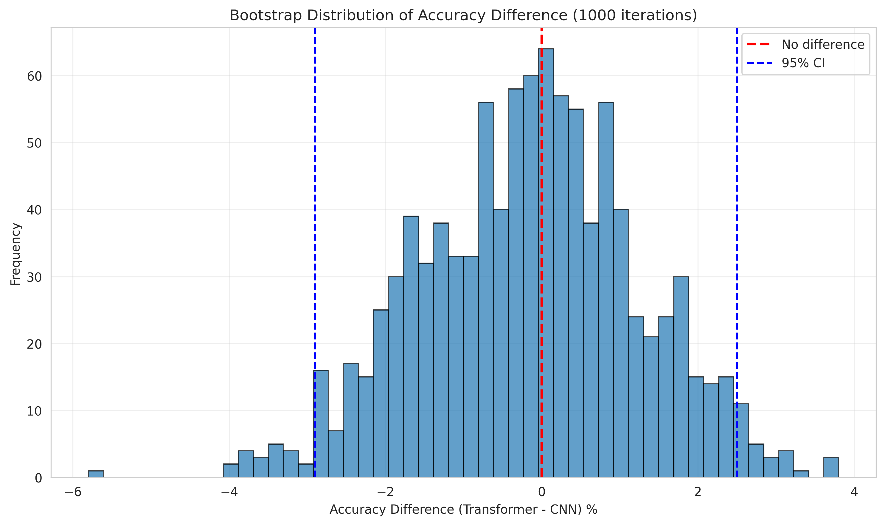
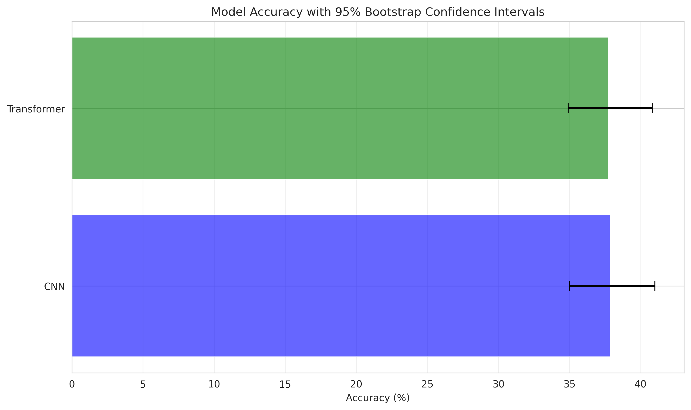
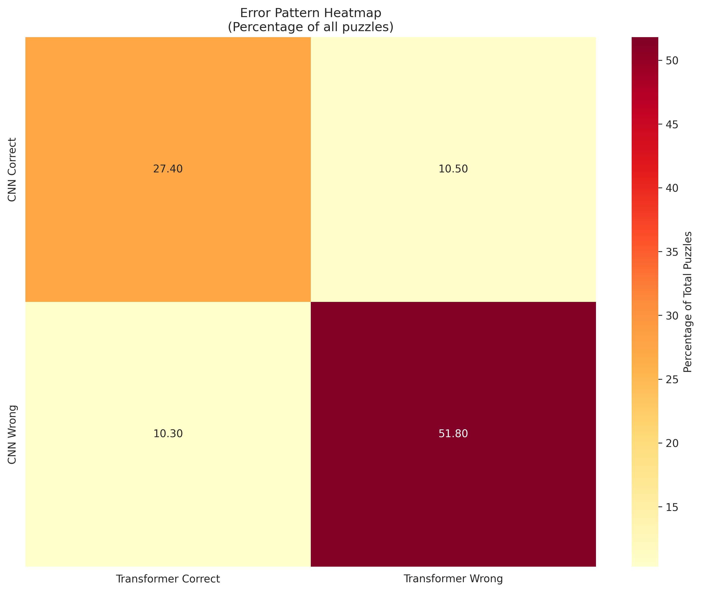

# Statistical Analysis Report: CNN vs Transformer Chess Models

**Analysis Date**: 2026-01-24 09:31:58

---

## Executive Summary

This report presents a comprehensive statistical analysis of 1,000 chess puzzle predictions comparing CNN and Transformer models.

## Overall Performance

### Top-1 Accuracy

| Model | Accuracy | 95% CI |
|-------|----------|--------|
| CNN | 37.86% | [35.00, 41.00] |
| Transformer | 37.70% | [34.90, 40.80] |
| **Difference** | **-0.16%** | **[-2.90, 2.50]** |

### Top-5 Accuracy

| Model | Accuracy |
|-------|----------|
| CNN | 73.70% |
| Transformer | 76.00% |
| **Difference** | **2.30%** |

## Statistical Tests

### McNemar's Test

- **Chi-square statistic**: 0.0048
- **P-value**: 0.944721
- **Result**: No statistically significant difference (p >= 0.05)

**Contingency Table:**

- CNN correct, Transformer wrong: 105
- CNN wrong, Transformer correct: 103

## Prediction Agreement

| Category | Count | Percentage |
|----------|-------|------------|
| Both Correct | 274 | 27.40% |
| Both Wrong | 518 | 51.80% |
| CNN Only | 105 | 10.50% |
| Transformer Only | 103 | 10.30% |

## Rating Stratification

Performance breakdown by puzzle difficulty rating:

| Rating Bin   |   Count |   CNN Accuracy (%) |   Transformer Accuracy (%) |   Difference (%) |   Cohen's d |
|:-------------|--------:|-------------------:|---------------------------:|-----------------:|------------:|
| 400-800      |      96 |            54.1667 |                    48.9583 |        -5.20833  |  -0.103814  |
| 800-1200     |     257 |            40.0778 |                    42.0233 |         1.94553  |   0.0394799 |
| 1200-1600    |     230 |            40.4348 |                    39.1304 |        -1.30435  |  -0.0265937 |
| 1600-2000    |     199 |            30.1508 |                    28.6432 |        -1.50754  |  -0.0330119 |
| 2000-2400    |     162 |            33.9506 |                    34.5679 |         0.617284 |   0.0129671 |
| 2400-2800    |      51 |            27.451  |                    31.3725 |         3.92157  |   0.0852973 |
| 2800+        |       5 |            40      |                    60      |        20        |   0.365148  |

## Theme Stratification

Performance breakdown by puzzle theme (top themes by count):

| Theme            |    Count |   CNN Accuracy (%) |   Transformer Accuracy (%) |   Difference (%) |
|:-----------------|---------:|-------------------:|---------------------------:|-----------------:|
| short            | 117.875  |            36.3915 |                    36.7813 |         0.38984  |
| endgame          | 113.549  |            40.3498 |                    38.904  |        -1.44578  |
| middlegame       | 111.544  |            34.8164 |                    35.8473 |         1.03098  |
| crushing         |  92.3135 |            34.1383 |                    33.785  |        -0.353351 |
| advantage        |  75.1524 |            28.9412 |                    31.3142 |         2.37296  |
| mate             |  64.9619 |            49.3568 |                    46.2799 |        -3.07689  |
| long             |  61.7643 |            32.5045 |                    33.3276 |         0.823021 |
| oneMove          |  32.7095 |            47.132  |                    45.3487 |        -1.78337  |
| mateIn1          |  32.4595 |            46.7249 |                    44.9277 |        -1.79711  |
| fork             |  29.7385 |            30.5721 |                    32.8138 |         2.24176  |
| master           |  28.6837 |            43.3255 |                    44.11   |         0.784417 |
| mateIn2          |  25.4821 |            52.0766 |                    46.2275 |        -5.8491   |
| veryLong         |  20.9956 |            33.0454 |                    28.6341 |        -4.41135  |
| kingsideAttack   |  17.3881 |            38.402  |                    35.4306 |        -2.97138  |
| sacrifice        |  15.0825 |            29.2596 |                    37.4921 |         8.23248  |
| defensiveMove    |  13.4857 |            36.1052 |                    34.8694 |        -1.23588  |
| opening          |  12.7512 |            24.8996 |                    24.5075 |        -0.39212  |
| discoveredAttack |  11.2857 |            31.0232 |                    41.2869 |        10.2637   |
| pin              |  10.9325 |            32.7223 |                    32.0363 |        -0.686025 |
| rookEndgame      |  10.219  |            36.2302 |                    41.123  |         4.89282  |

## Game Phase Stratification

Performance breakdown by game phase:

| Phase      |   Count |   CNN Accuracy (%) |   Transformer Accuracy (%) |   Difference (%) |   Cohen's d |
|:-----------|--------:|-------------------:|---------------------------:|-----------------:|------------:|
| Opening    |     341 |            33.4311 |                    34.3109 |         0.879765 |   0.0185626 |
| Middlegame |     474 |            40.0844 |                    39.0295 |        -1.05485  |  -0.0215513 |
| Endgame    |     185 |            40.5405 |                    40.5405 |         0        |   0         |

## Additional Visualizations

### Bootstrap Analysis

### Error Patterns

### Feature Correlations

## Key Findings

1. **Overall Performance**: The models show nearly identical top-1 accuracy (difference: -0.16%).

2. **Rating Stratification**: Largest performance difference observed in 2800+ rating range (20.00%).

3. **Theme Stratification**: Largest performance difference observed for 'discoveredAttack' theme (10.26%).

4. **Top-5 Accuracy**: The performance gap widens to 2.30% when considering top-5 predictions.

5. **Statistical Significance**: McNemar's test does not indicate a statistically significant difference (p = 0.944721).

## Conclusions

This analysis reveals:

- The models show different strengths across puzzle ratings and themes
- Stratified analysis provides deeper insights than aggregate metrics alone
- Both models have substantial room for improvement (< 40% top-1 accuracy)
- Consider ensemble approaches to leverage complementary strengths

## Files Generated

This analysis generated the following output files:

- `analysis_report.md` - This comprehensive report
- `summary_statistics.csv` - Overall summary statistics
- `mcnemar_test.txt` - McNemar's test detailed results
- `bootstrap_confidence.png` - Bootstrap confidence intervals
- `bootstrap_distribution.png` - Bootstrap distribution plot
- `rating_stratification.csv` / `.png` - Performance by rating
- `theme_stratification.csv` / `.png` - Performance by theme
- `phase_stratification.csv` / `.png` - Performance by game phase
- `error_heatmap.png` - Error pattern visualization
- `feature_correlations.png` - Feature-error correlations

---

*Report generated automatically by statistical_analysis.py*
