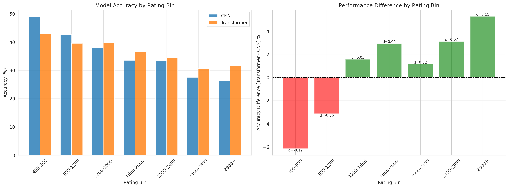
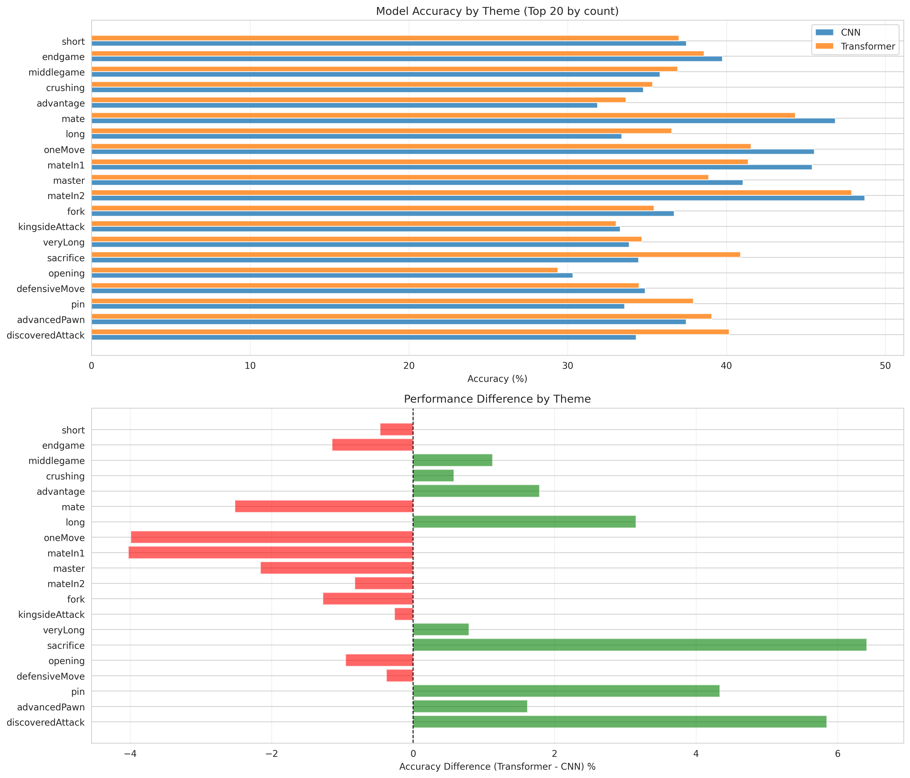
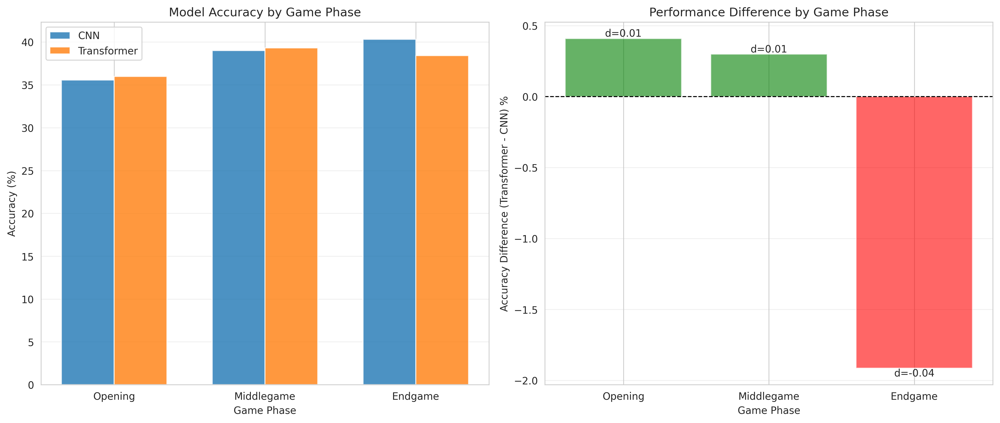
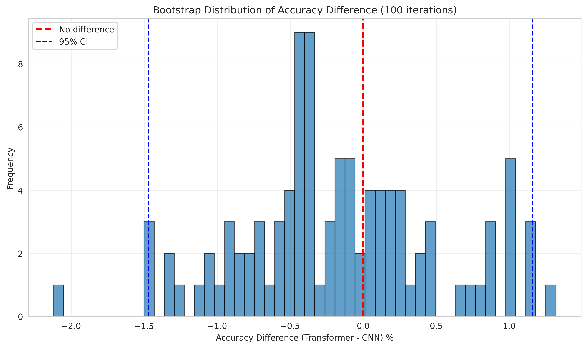
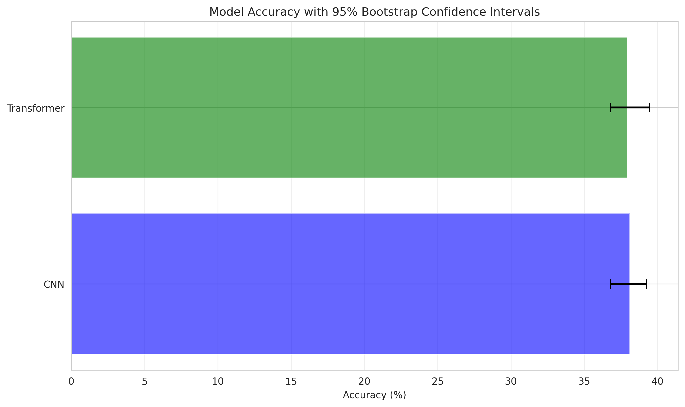
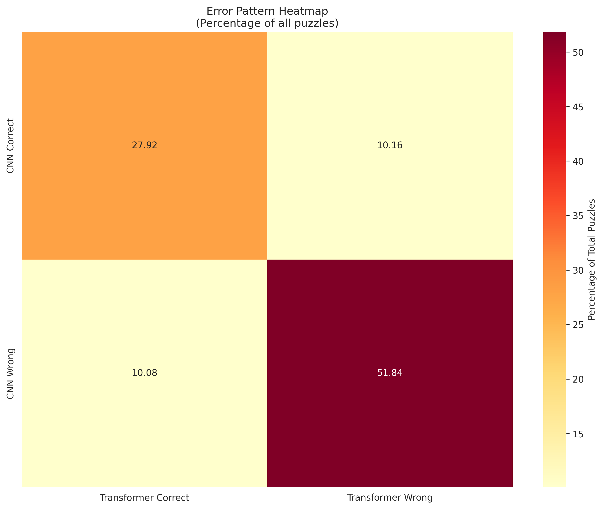

# Statistical Analysis Report: CNN vs Transformer Chess Models

**Analysis Date**: 2026-01-23 20:06:43

---

## Executive Summary

This report presents a comprehensive statistical analysis of 5,000 chess puzzle predictions comparing CNN and Transformer models.

## Overall Performance

### Top-1 Accuracy

| Model | Accuracy | 95% CI |
|-------|----------|--------|
| CNN | 38.12% | [36.80, 39.25] |
| Transformer | 37.94% | [36.79, 39.43] |
| **Difference** | **-0.17%** | **[-1.47, 1.16]** |

### Top-5 Accuracy

| Model | Accuracy |
|-------|----------|
| CNN | 74.94% |
| Transformer | 77.10% |
| **Difference** | **2.16%** |

## Statistical Tests

### McNemar's Test

- **Chi-square statistic**: 0.0089
- **P-value**: 0.924868
- **Result**: No statistically significant difference (p >= 0.05)

**Contingency Table:**

- CNN correct, Transformer wrong: 508
- CNN wrong, Transformer correct: 504

## Prediction Agreement

| Category | Count | Percentage |
|----------|-------|------------|
| Both Correct | 1,396 | 27.92% |
| Both Wrong | 2,592 | 51.84% |
| CNN Only | 508 | 10.16% |
| Transformer Only | 504 | 10.08% |

## Rating Stratification

Performance breakdown by puzzle difficulty rating:

| Rating Bin   |   Count |   CNN Accuracy (%) |   Transformer Accuracy (%) |   Difference (%) |   Cohen's d |
|:-------------|--------:|-------------------:|---------------------------:|-----------------:|------------:|
| 400-800      |     472 |            48.9407 |                    42.7966 |         -6.14407 |  -0.123407  |
| 800-1200     |    1309 |            42.628  |                    39.4958 |         -3.13216 |  -0.0636767 |
| 1200-1600    |    1214 |            38.056  |                    39.6211 |          1.56507 |   0.0321027 |
| 1600-2000    |    1027 |            33.4956 |                    36.4167 |          2.92113 |   0.0612602 |
| 2000-2400    |     701 |            33.2382 |                    34.3795 |          1.14123 |   0.024109  |
| 2400-2800    |     258 |            27.5194 |                    30.6202 |          3.10078 |   0.0681936 |
| 2800+        |      19 |            26.3158 |                    31.5789 |          5.26316 |   0.113147  |

## Theme Stratification

Performance breakdown by puzzle theme (top themes by count):

| Theme            |    Count |   CNN Accuracy (%) |   Transformer Accuracy (%) |   Difference (%) |
|:-----------------|---------:|-------------------:|---------------------------:|-----------------:|
| short            | 608.663  |            37.4756 |                    37.0099 |        -0.465697 |
| endgame          | 576.333  |            39.7392 |                    38.5924 |        -1.14682  |
| middlegame       | 559.6    |            35.8057 |                    36.9292 |         1.12346  |
| crushing         | 448.362  |            34.7645 |                    35.3409 |         0.576437 |
| advantage        | 368.829  |            31.8789 |                    33.6635 |         1.78461  |
| mate             | 341.523  |            46.8591 |                    44.3392 |        -2.51987  |
| long             | 301.049  |            33.409  |                    36.559  |         3.15009  |
| oneMove          | 168.935  |            45.5382 |                    41.5475 |        -3.9907   |
| mateIn1          | 167.435  |            45.3987 |                    41.3722 |        -4.02645  |
| master           | 142.529  |            41.0328 |                    38.8736 |        -2.15912  |
| mateIn2          | 138.307  |            48.7158 |                    47.8894 |        -0.826318 |
| fork             | 131.926  |            36.7111 |                    35.4351 |        -1.27597  |
| kingsideAttack   |  85.1024 |            33.31   |                    33.047  |        -0.262989 |
| veryLong         |  82.8829 |            33.875  |                    34.6635 |         0.788548 |
| sacrifice        |  67.3365 |            34.4703 |                    40.8809 |         6.41059  |
| opening          |  64.6798 |            30.3308 |                    29.3773 |        -0.953415 |
| defensiveMove    |  61.948  |            34.8744 |                    34.4977 |        -0.37666  |
| pin              |  58.2242 |            33.5812 |                    37.9158 |         4.33464  |
| advancedPawn     |  55.9516 |            37.4601 |                    39.075  |         1.61492  |
| discoveredAttack |  54.4417 |            34.3181 |                    40.1653 |         5.84724  |

## Game Phase Stratification

Performance breakdown by game phase:

| Phase      |   Count |   CNN Accuracy (%) |   Transformer Accuracy (%) |   Difference (%) |   Cohen's d |
|:-----------|--------:|-------------------:|---------------------------:|-----------------:|------------:|
| Opening    |    1712 |            35.5724 |                    35.9813 |         0.408879 |  0.00852755 |
| Middlegame |    2348 |            39.0119 |                    39.3101 |         0.298126 |  0.00610649 |
| Endgame    |     940 |            40.3191 |                    38.4043 |        -1.91489  | -0.039182   |

## Additional Visualizations

### Bootstrap Analysis

### Error Patterns

### Feature Correlations

## Key Findings

1. **Overall Performance**: The models show nearly identical top-1 accuracy (difference: -0.17%).

2. **Rating Stratification**: Largest performance difference observed in 400-800 rating range (-6.14%).

3. **Theme Stratification**: Largest performance difference observed for 'sacrifice' theme (6.41%).

4. **Top-5 Accuracy**: The performance gap widens to 2.16% when considering top-5 predictions.

5. **Statistical Significance**: McNemar's test does not indicate a statistically significant difference (p = 0.924868).

## Conclusions

This analysis reveals:

- The models show different strengths across puzzle ratings and themes
- Stratified analysis provides deeper insights than aggregate metrics alone
- Both models have substantial room for improvement (< 40% top-1 accuracy)
- Consider ensemble approaches to leverage complementary strengths

## Files Generated

This analysis generated the following output files:

- `analysis_report.md` - This comprehensive report
- `summary_statistics.csv` - Overall summary statistics
- `mcnemar_test.txt` - McNemar's test detailed results
- `bootstrap_confidence.png` - Bootstrap confidence intervals
- `bootstrap_distribution.png` - Bootstrap distribution plot
- `rating_stratification.csv` / `.png` - Performance by rating
- `theme_stratification.csv` / `.png` - Performance by theme
- `phase_stratification.csv` / `.png` - Performance by game phase
- `error_heatmap.png` - Error pattern visualization
- `feature_correlations.png` - Feature-error correlations

---

*Report generated automatically by statistical_analysis.py*
