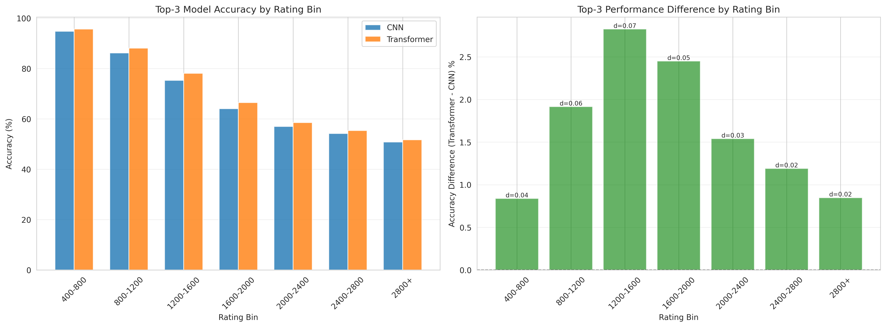
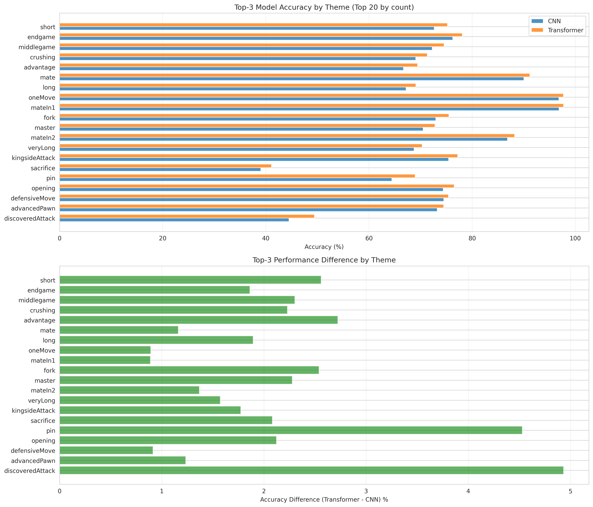
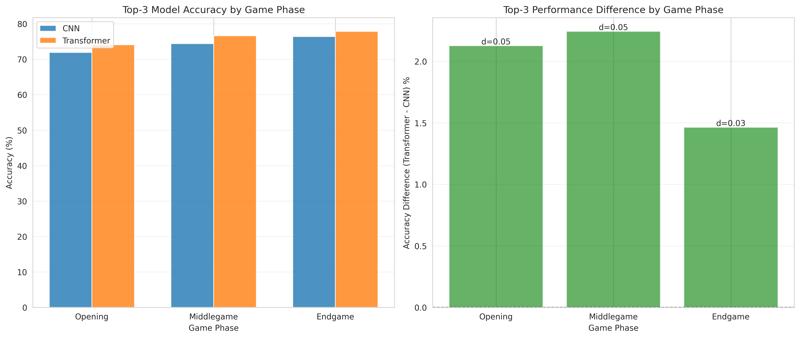

# Top-3 Statistical Analysis Report: CNN vs Transformer Chess Models

**Analysis Date**: 2026-01-24 13:20:58

---

## Executive Summary

This report presents a comprehensive statistical analysis of 5,600,086 chess puzzle predictions comparing CNN and Transformer models using Top-3 accuracy metrics.

## Overall Performance

### Top-3 Accuracy

| Model | Accuracy | 95% CI |
|-------|----------|--------|
| CNN | 73.93% | [73.89, 73.97] |
| Transformer | 75.98% | [75.95, 76.02] |
| **Difference** | **2.05%** | **[2.03, 2.07]** |

## Statistical Tests

### McNemar's Test

- **Chi-square statistic**: 56140.0416
- **P-value**: 0.000000
- **Result**: Statistically significant difference (p < 0.05)

**Contingency Table:**

- CNN correct, Transformer wrong: 59,925
- CNN wrong, Transformer correct: 174,693

## Prediction Agreement

| Category | Count | Percentage |
|----------|-------|------------|
| Both Correct | 4,080,302 | 72.86% |
| Both Wrong | 1,285,166 | 22.95% |
| CNN Only | 59,925 | 1.07% |
| Transformer Only | 174,693 | 3.12% |

## Rating Stratification

Performance breakdown by puzzle difficulty rating:

| Rating Bin   |   Count |   CNN Accuracy (%) |   Transformer Accuracy (%) |   Difference (%) |   Cohen's d |
|:-------------|--------:|-------------------:|---------------------------:|-----------------:|------------:|
| 400-800      |  519803 |            94.8461 |                    95.6847 |         0.838587 |   0.0394933 |
| 800-1200     | 1480817 |            86.2228 |                    88.1388 |         1.91604  |   0.0573379 |
| 1200-1600    | 1349092 |            75.3128 |                    78.1383 |         2.82546  |   0.0668993 |
| 1600-2000    | 1148221 |            64.079  |                    66.5286 |         2.44962  |   0.0514791 |
| 2000-2400    |  779902 |            56.9927 |                    58.533  |         1.54032  |   0.0311883 |
| 2400-2800    |  305270 |            54.2081 |                    55.3985 |         1.19042  |   0.0239207 |
| 2800+        |   16981 |            50.8627 |                    51.7107 |         0.848007 |   0.0169659 |

## Theme Stratification

Performance breakdown by puzzle theme (top themes by count):

| Theme            |    Count |   CNN Accuracy (%) |   Transformer Accuracy (%) |   Difference (%) |
|:-----------------|---------:|-------------------:|---------------------------:|-----------------:|
| short            | 693709   |            72.6475 |                    75.207  |         2.55948  |
| endgame          | 652728   |            76.2329 |                    78.095  |         1.86212  |
| middlegame       | 624683   |            72.2656 |                    74.5676 |         2.30195  |
| crushing         | 517224   |            69.0735 |                    71.3033 |         2.2298   |
| advantage        | 418061   |            66.7073 |                    69.4296 |         2.72235  |
| mate             | 361345   |            90.0398 |                    91.2019 |         1.16211  |
| long             | 337220   |            67.1977 |                    69.0922 |         1.8945   |
| oneMove          | 172690   |            96.8119 |                    97.7033 |         0.891396 |
| mateIn1          | 171943   |            96.8567 |                    97.7456 |         0.888882 |
| fork             | 159836   |            72.9659 |                    75.5051 |         2.53912  |
| master           | 155849   |            70.5146 |                    72.7921 |         2.27748  |
| mateIn2          | 151316   |            86.8715 |                    88.2401 |         1.3686   |
| veryLong         |  96455.9 |            68.7258 |                    70.299  |         1.57322  |
| kingsideAttack   |  92353.4 |            75.4398 |                    77.2122 |         1.7724   |
| sacrifice        |  72333   |            39.0194 |                    41.1009 |         2.08148  |
| pin              |  70053.6 |            64.4239 |                    68.9523 |         4.52835  |
| opening          |  68912.5 |            74.4035 |                    76.5254 |         2.12194  |
| defensiveMove    |  68626.1 |            74.4969 |                    75.4106 |         0.913678 |
| advancedPawn     |  62247   |            73.2376 |                    74.4725 |         1.23492  |
| discoveredAttack |  59818.2 |            44.4787 |                    49.4116 |         4.93294  |

## Game Phase Stratification

Performance breakdown by game phase:

| Phase      |   Count |   CNN Accuracy (%) |   Transformer Accuracy (%) |   Difference (%) |   Cohen's d |
|:-----------|--------:|-------------------:|---------------------------:|-----------------:|------------:|
| Opening    | 1910446 |            71.9153 |                    74.0403 |          2.125   |   0.0478661 |
| Middlegame | 2593450 |            74.3817 |                    76.6236 |          2.24188 |   0.0521458 |
| Endgame    | 1096190 |            76.3801 |                    77.8423 |          1.46225 |   0.034811  |

## Additional Visualizations

### Bootstrap Analysis

## Key Findings

1. **Overall Performance**: Transformer outperforms CNN by 2.05% in top-3 accuracy.

2. **Rating Stratification**: Largest performance difference observed in 1200-1600 rating range (2.83%).

3. **Theme Stratification**: Largest performance difference observed for 'discoveredAttack' theme (4.93%).

4. **Statistical Significance**: McNemar's test indicates a statistically significant difference (p = 0.000000).

## Conclusions

This analysis reveals:

- The models show different strengths across puzzle ratings and themes
- Stratified analysis provides deeper insights than aggregate metrics alone
- Top-3 accuracy shows how often the correct move is within the top 3 predictions
- Consider ensemble approaches to leverage complementary strengths

## Files Generated

This analysis generated the following output files:

- `top3_analysis_report.md` - This comprehensive report
- `top3_mcnemar_test.txt` - McNemar's test detailed results
- `top3_bootstrap_confidence.png` - Bootstrap confidence intervals
- `top3_bootstrap_distribution.png` - Bootstrap distribution plot
- `top3_rating_stratification.csv` / `.png` - Performance by rating
- `top3_theme_stratification.csv` / `.png` - Performance by theme
- `top3_phase_stratification.csv` / `.png` - Performance by game phase

---

*Report generated automatically by statistical_analysis.py*
